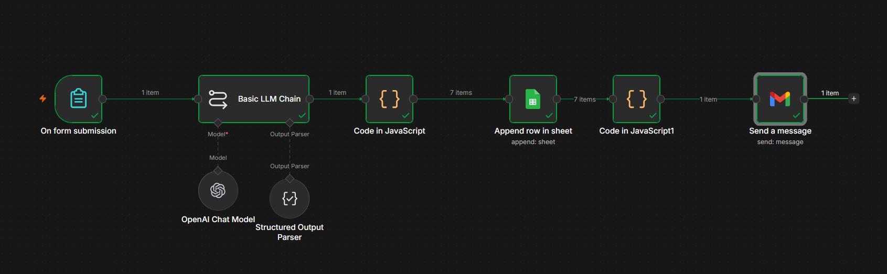
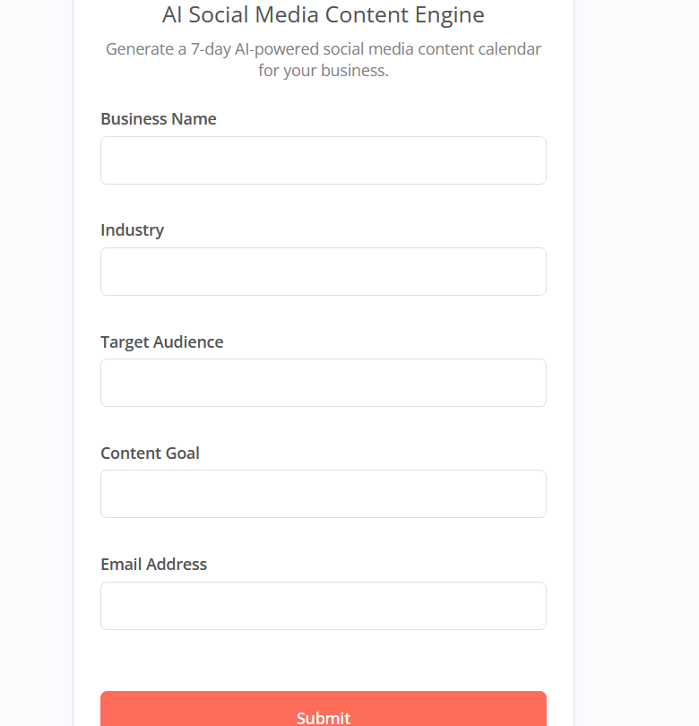

# 🚀 AI Social Media Content Engine

An AI-powered social media automation workflow built with n8n, OpenAI, Google Sheets, and Gmail.

This workflow generates a complete 7-day social media content calendar based on business information submitted through a form, automatically saves the content to Google Sheets, and emails the content plan to the user.

---

## 📌 Features

✅ AI-generated 7-day content calendar

✅ Custom content based on industry and target audience

✅ Captions for every post

✅ Call-to-Action (CTA) generation

✅ Relevant hashtag generation

✅ Automatic Google Sheets storage

✅ Automated email delivery

✅ Fully no-code/low-code workflow

---

## 🛠 Tech Stack

- n8n
- OpenAI GPT
- Google Sheets
- Gmail
- HTML Email Templates

---

## 📋 Workflow Overview

1. User submits business information through a form.
2. OpenAI generates a 7-day social media content plan.
3. Content is structured into:
   - Day
   - Post Type
   - Caption
   - CTA
   - Hashtags
4. Data is saved automatically to Google Sheets.
5. User receives an email confirmation with the generated content calendar.

---

## 🔄 Workflow Architecture

Form Submission
↓
OpenAI Content Generation
↓
Structured Output Parser
↓
Data Transformation
↓
Google Sheets Storage
↓
Email Delivery

---

## 📸 Screenshots

### Workflow Canvas

### Form Submission

### AI Generated Content

### Google Sheets Integration

### Email Delivery

---

## 📊 Sample Output

| Day | Post Type | CTA |
|------|------------|------|
| Day 1 | Educational | Learn More |
| Day 2 | Testimonial | Read Full Story |
| Day 3 | How-To | Get Started |
| Day 4 | Video | Watch Now |
| Day 5 | Infographic | Download Guide |
| Day 6 | Carousel | Swipe Through |
| Day 7 | Poll | Vote Now |

---

## 💼 Business Use Cases

- Marketing Agencies
- Coaches & Consultants
- Local Businesses
- E-commerce Brands
- SaaS Companies
- Content Creators
- Startups

---

## 📦 Deliverables

- Complete n8n Workflow
- OpenAI Integration
- Google Sheets Integration
- Gmail Integration
- Documentation
- Source Code

---

## 🎯 Benefits

- Saves hours of content planning
- Generates engaging social media content instantly
- Improves marketing consistency
- Reduces manual effort
- Scalable for multiple clients

---

## 📄 License

This project is for educational and portfolio purposes.

---

## 👨‍💻 Author

Akshay Patel

GitHub: https://github.com/akshayakn13
